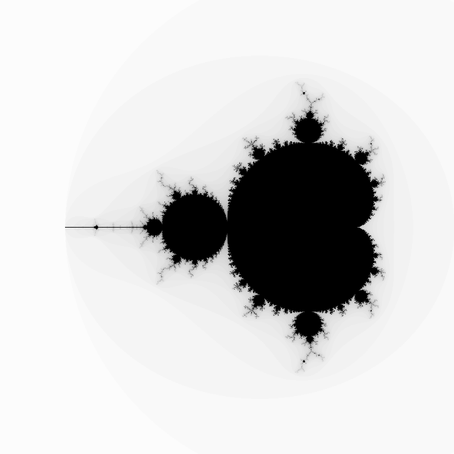

# fractal-gen-opencl

This is a work-in-progress port of my simple fractal-gen software to OpenCL.
That software was an experiment of mine to generate mandelbrot (and some of
its cousin) fractals on CPU. This is my attempt at porting that software to
OpenCL so it can be used on a multitude of computation devices, including GPUs.

I had started to port it to CUDA in October 2016, but changed to CL because
of its portability and open nature.

Software is still in early days and needs more CL kernels for such fractals as
tricorn, burning ship, and julia sets to name a few.

Below is a simple demo image produced with the software. It is a simple
mandelbrot fractal using only 75 iterations, at 768 square pixels. The
image is a negative of that which comes straight from the software.

Such a small, low-detail image will not provide a case for using GPU rather
than CPU, but once you start upping the image size and detail, a modern GPU
will provide endless benefit over a modern CPU.

For example, using the CPU-based fractal-gen, a 10240x10240 pixel image at
1000 iteration cutout per pixel, the image will complete in just under 4
minutes when running on all 32 threads of a dual-Xeon E5-2670 setup. Compare
this to the runtime of this software on a (much cheaper) NVIDIA GTX 1070; about
0.5 to 1 second.

The gap only widens with more detail. Keeping the same image dimensions and
climbing up to 10000 iterations, the Xeons will take 2200 seconds; just under
37 minutes. The GTX 1070 takes just over 1 second.
